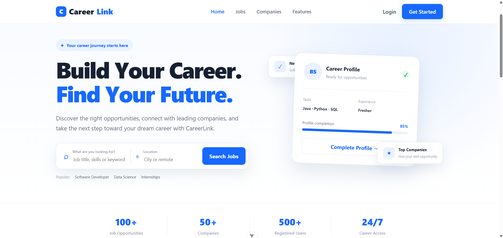
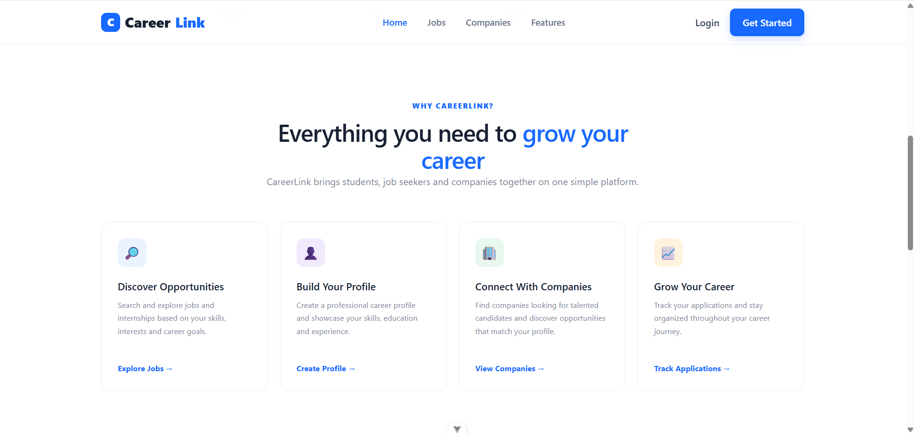
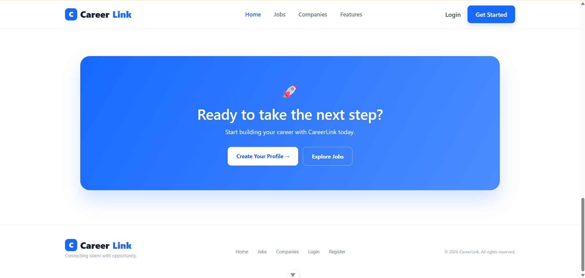
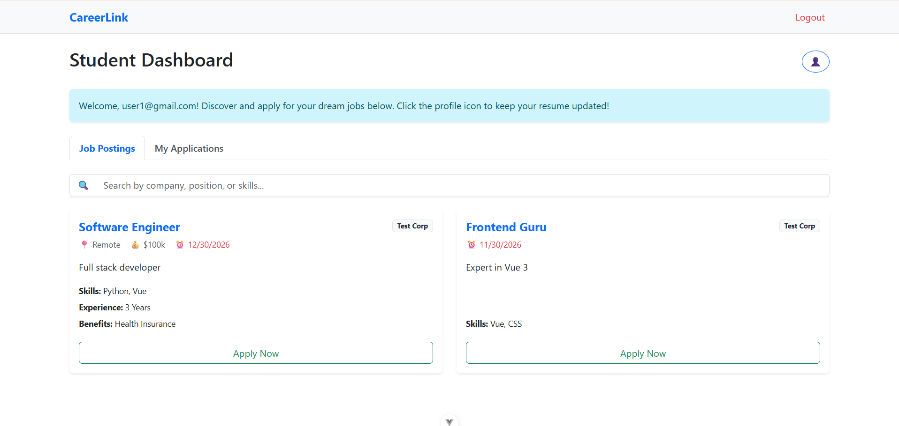
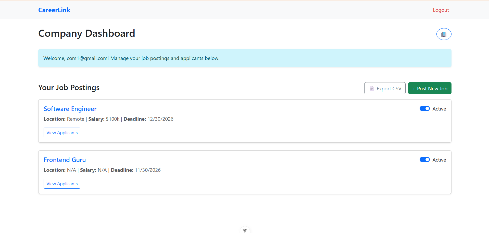
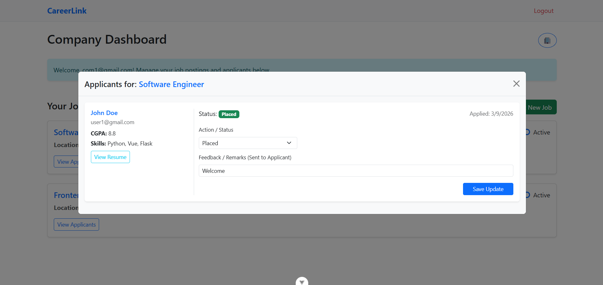
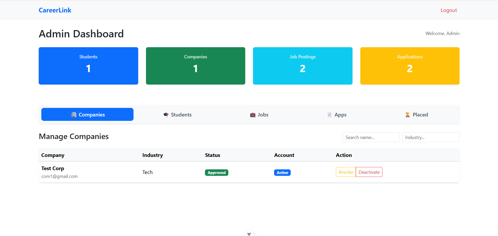

# CareerLink

> A full-stack placement portal for managing students, companies, job opportunities, applications, and placement records.

[](https://vuejs.org/)
[](https://flask.palletsprojects.com/)
[](https://redis.io/)
[](https://docs.celeryq.dev/)
[](LICENSE)

## Overview

CareerLink is an academic full-stack web application that digitizes common campus-placement workflows.

The application provides separate experiences for three roles:

- **Student** — maintain a profile, browse jobs, apply, and track applications.
- **Company** — manage a company profile, create job postings, review applicants, and update application statuses.
- **Admin** — monitor platform statistics and manage companies, students, jobs, applications, and placements.

The frontend is a Vue 3 single-page application. The backend exposes a Flask-RESTful API backed by SQLite and SQLAlchemy. Redis is used as the cache and Celery message broker, while Celery/Celery Beat handle asynchronous and scheduled tasks.

## Key Features

### Student

- Registration and token-based authentication
- Academic/profile information
- Job and placement-drive discovery
- Job applications
- Application-status tracking
- Resume information
- Application CSV export

### Company

- Company registration and profile management
- Admin approval workflow
- Job/placement-drive creation and editing
- Applicant listing
- Application-status updates
- Interview date and feedback fields
- Application CSV export

### Admin

- Dashboard statistics
- Company approval/revocation
- Student activation/deactivation
- Job activation/deactivation/removal
- Application monitoring
- Placement-history management

### Platform

- REST API with role-based access control
- SQLite database with SQLAlchemy ORM
- Redis caching
- Celery background jobs
- Celery Beat scheduled jobs
- Asynchronous CSV export
- HTML monthly activity reports
- Scheduled interview-reminder task

## Screenshots

The screenshots below show the main application interfaces.

### Landing Page

<p align="center">
  
</p>

### Features & Job Search

<table>
  <tr>
    <td align="center"><b>Features</b></td>
    <td align="center"><b>Hero / Job Search</b></td>
  </tr>
  <tr>
    <td>
      
    </td>
    <td>
      
    </td>
  </tr>
</table>

### Role Dashboards

<table>
  <tr>
    <td align="center"><b>Student</b></td>
    <td align="center"><b>Company</b></td>
  </tr>
  <tr>
    <td>
      
    </td>
    <td>
      
    </td>
  </tr>
</table>

### Company Jobs & Admin

<table>
  <tr>
    <td align="center"><b>Company Job Listings</b></td>
    <td align="center"><b>Admin Dashboard</b></td>
  </tr>
  <tr>
    <td>
      
    </td>
    <td>
      
    </td>
  </tr>
</table>

## Technology Stack

| Layer | Technology |
|---|---|
| Frontend | Vue.js 3 |
| Frontend tooling | Vite |
| State management | Pinia |
| Routing | Vue Router |
| Styling | Bootstrap 5.3 (CDN) + project CSS |
| Backend | Python, Flask |
| API | Flask-RESTful |
| Authentication | Flask-Security-Too |
| ORM | Flask-SQLAlchemy |
| Database | SQLite |
| Cache | Flask-Caching + Redis |
| Background jobs | Celery |
| Scheduling | Celery Beat |
| Message broker / result backend | Redis |
| Data export | Python CSV library |
| Reporting | HTML reports |
| Version control | Git / GitHub |

## Architecture

```text
                           CareerLink
                               |
              +----------------+----------------+
              |                                 |
              v                                 v
        Vue 3 + Vite                       Flask API
              |                                 |
              |                         Flask-RESTful
              |                                 |
              |                    Flask-Security-Too
              |                                 |
              |                        SQLAlchemy ORM
              |                                 |
              |                                 v
              |                              SQLite
              |
              +----------------+----------------+
                               |
                               v
                         Redis + Celery
                               |
                 +-------------+-------------+
                 |                           |
                 v                           v
          Background Tasks               Caching
                 |
        +--------+---------+
        |                  |
        v                  v
   CSV Exports       Scheduled Tasks
                     / Interview Reminders
                     / Monthly HTML Reports
```

The frontend and backend are kept as separate applications. The frontend communicates with the backend through the REST API.

## Application Workflow

```text
Company Registration
        |
        v
   Admin Approval
        |
        v
 Company Creates Job
        |
        v
 Student Browses Jobs
        |
        v
   Student Applies
        |
        v
 Company Reviews Application
        |
   +----+---------+----------------+
   |              |                |
   v              v                v
Shortlisted     Rejected        Selected
   |                               |
   v                               v
Interview / Offer              Placement
        \                         /
         +-------- Tracking -----+
```

Application statuses implemented by the UI include:

`Applied` → `Shortlisted` → `Interview Scheduled` → `Offer` → `Selected` / `Placed`

with `Rejected` as an alternative outcome.

## Database Model

The main entities are:

- `User` — authentication and account state.
- `Role` — Admin, Student, and Company roles.
- `Student` — student profile, education, CGPA, skills, experience, and resume filename.
- `Company` — company profile and approval state.
- `Job` — company-created job/placement-drive information.
- `Application` — relationship between a student and a job, including status, feedback, and interview date.
- `Placement` — records a successful placement associated with a student, company, job, and application.

Simplified relationship:

```text
User
├── Student
│    ├── Applications ──> Job
│    └── Placement
│
├── Company
│    ├── Jobs ──> Applications
│    └── Placements
│
└── Roles
```

## Background Processing

CareerLink uses Celery with Redis for operations that do not need to block a normal web request.

### CSV export

A student or company can submit an export request. The export is generated by a Celery task and can then be downloaded through the API.

```text
POST /api/export
       |
       v
Celery task
       |
       v
Generate CSV
       |
       v
Poll task status
       |
       v
Download file
```

### Scheduled tasks

Celery Beat is configured with:

- A daily interview-reminder task.
- A monthly placement-activity report task.

The monthly report currently generates an **HTML report**. The repository does not implement a general PDF-report generation pipeline, so this README does not describe PDF generation as an implemented feature.

> **Note:** The interview-reminder code currently uses a Google Chat webhook for demonstration purposes. It should be replaced with environment-based configuration before production use.

## Caching

Flask-Caching is configured with Redis.

The backend uses caching for selected frequently accessed data, including job/dashboard-related API responses. Cache configuration currently points to Redis database `3`.

Celery uses separate Redis databases for its broker and result backend.

## REST API

The API is mounted under:

```text
/api
```

### Authentication

| Method | Endpoint | Purpose |
|---|---|---|
| POST | `/api/login` | Authenticate a user |
| POST | `/api/logout` | Log out |
| POST | `/api/register` | Register a student or company |
| GET | `/api/check_email` | Check email availability |

Protected requests use the `Authentication-Token` header.

### Student

| Method | Endpoint | Purpose |
|---|---|---|
| GET | `/api/student_profile` | Get student profile |
| PUT | `/api/student_profile` | Update student profile |
| GET | `/api/student/jobs` | List jobs |
| GET | `/api/student/applications` | List applications |
| POST | `/api/student/jobs/<job_id>/apply` | Apply for a job |

### Company

| Method | Endpoint | Purpose |
|---|---|---|
| GET | `/api/company_profile` | Get company profile |
| PUT | `/api/company_profile` | Update company profile |
| GET | `/api/company/jobs` | List company jobs |
| POST | `/api/company/jobs` | Create a job |
| PUT | `/api/company/jobs/<job_id>` | Update a job |
| GET | `/api/company/jobs/<job_id>/applications` | View applicants |
| PUT | `/api/company/applications/<app_id>` | Update an application |

### Admin

| Method | Endpoint | Purpose |
|---|---|---|
| GET | `/api/admin/stats` | Dashboard statistics |
| GET/POST | `/api/admin/companies` | Manage companies |
| GET/POST | `/api/admin/students` | Manage students |
| GET/POST | `/api/admin/jobs` | Manage jobs |
| GET/POST | `/api/admin/applications` | Manage applications |
| GET/POST | `/api/admin/placements` | Manage placements |

### Export

| Method | Endpoint | Purpose |
|---|---|---|
| POST | `/api/export` | Start an application CSV export |
| GET | `/api/export/status/<task_id>` | Check export task status |
| GET | `/api/export/download/<file_name>` | Download generated CSV |

## Project Structure

```text
CareerLink/
├── backend/
│   ├── app.py
│   ├── requirements.txt
│   ├── controllers/
│   │   ├── models.py
│   │   ├── auth_api.py
│   │   ├── student_api.py
│   │   ├── company_api.py
│   │   ├── admin_api.py
│   │   ├── export_api.py
│   │   ├── cache.py
│   │   ├── celery_app.py
│   │   ├── tasks.py
│   │   └── config.py
│   ├── instance/
│   │   └── site.db
│   └── exports/
│
├── frontend/
│   ├── package.json
│   ├── package-lock.json
│   ├── index.html
│   └── src/
│       ├── views/
│       ├── router/
│       ├── stores/
│       └── main.js
│
├── assets/
│   └── screenshots/
│
├── LICENSE
└── README.md
```

## How to Run

### Prerequisites

Install:

- Python 3.x
- Node.js compatible with the frontend requirement (`20.19+` or `22.12+`)
- npm
- Redis Server
- Git

### 1. Clone the repository

```bash
git clone https://github.com/bhushan-ssh/CareerLink.git
cd CareerLink
```

### 2. Start Redis

Make sure Redis is running on:

```text
localhost:6379
```

#### Windows

If Redis is installed in `C:\Redis`:

```powershell
cd C:\Redis
.\redis-server.exe
```

Keep this terminal running.

Verify Redis from another terminal:

```powershell
redis-cli ping
```

Expected:

```text
PONG
```

### 3. Set up the backend

Open a new terminal:

```powershell
cd CareerLink\backend
python -m venv venv
.\venv\Scripts\Activate.ps1
pip install -r requirements.txt
python app.py
```

The Flask development server should start locally.

Keep this terminal running.

### 4. Start the frontend

Open another terminal:

```powershell
cd CareerLink\frontend
npm install
npm run dev
```

Open the local URL printed by Vite in the terminal.

### 5. Start the Celery worker

Open another terminal:

```powershell
cd CareerLink\backend
.\venv\Scripts\Activate.ps1
celery -A app.celery_app worker --loglevel=info --pool=solo
```

Keep the worker running.

### 6. Start Celery Beat

Open another terminal:

```powershell
cd CareerLink\backend
.\venv\Scripts\Activate.ps1
celery -A app.celery_app beat --loglevel=info
```

Keep the scheduler running if you want the scheduled tasks to execute.

### Running services

For the complete local setup, you will normally have these processes running:

```text
Redis
  |
  +-- Flask backend
  |
  +-- Celery worker
  |
  +-- Celery Beat
  |
  +-- Vue/Vite frontend
```

## Development Notes

### Development database

The application is configured to use SQLite:

```text
sqlite:///site.db
```

The database is created/initialized when the Flask application starts.

### Development admin account

`backend/app.py` creates a development admin account when one does not already exist.

For security, do not rely on the hard-coded development credentials for a real deployment. Replace the initialization approach with environment-based credentials or an explicit setup process.

### Configuration

Redis endpoints and authentication configuration are currently defined in the backend source.

For production deployment, move secrets and environment-specific configuration into environment variables or a dedicated configuration system.

## Security Notes

This repository is an academic/development project and is **not presented as production-ready**.

Before deploying it publicly or to a real institution:

- Remove hard-coded secrets and webhook credentials.
- Move secret keys, salts, and service credentials to environment variables.
- Replace development/default admin credentials.
- Review token and session configuration.
- Restrict CORS to trusted origins.
- Replace SQLite with a production database if required.
- Add stronger validation and error handling.
- Add automated unit, integration, and end-to-end tests.
- Review file-download authorization and generated-file lifecycle.
- Use HTTPS in deployed environments.

## Known Limitations

- SQLite is used as the current database.
- The project does not include a full automated test suite.
- Advanced recommendation/matching features are not implemented.
- The monthly report is HTML-based rather than a general PDF reporting system.
- Notification integrations contain demonstration-oriented code and should be configured safely before deployment.
- Production deployment configuration is not included.

## Future Improvements

Potential extensions include:

- Resume parsing and job matching
- Skill-based candidate ranking
- Job recommendations
- Advanced placement analytics
- Real-time notifications
- PostgreSQL support
- Docker-based deployment
- Cloud deployment
- Centralized configuration and secrets management
- Expanded automated testing
- Production-grade monitoring and logging

## License

This project is licensed under the MIT License. See [LICENSE](LICENSE).

## Academic Project

CareerLink was developed as an academic full-stack project to explore:

- Full-stack web development
- REST API design
- Authentication and role-based authorization
- Relational database modeling
- Vue.js frontend development
- Asynchronous processing with Celery
- Redis caching and task brokering
- Scheduled background jobs
- Data export workflows
- Git and GitHub-based development

## Author

**Bhushan Dattatray Sonawane**

- Program: BS Degree in Data Science and Applications
- Institute: IIT Madras
- Project: CareerLink — Placement Portal

## Acknowledgment

AI-assisted development tools were used during development for selected coding and documentation tasks. The project was integrated, tested, and debugged as part of the development process.
